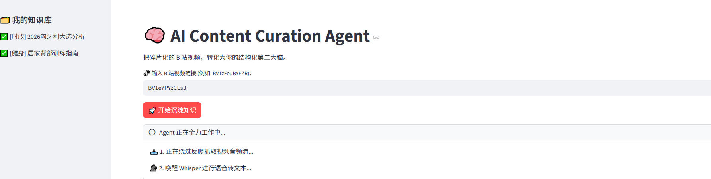

# BiliAgent: 基于大语言模型的视频知识提取与验证系统

> BiliAgent 是一个致力于将 B 站视频内容转化为结构化知识的自动化工具。系统通过集成语音识别与多智能体工作流，帮助用户高效提取长视频的核心信息，并对时政新闻类内容提供自动化的事实核查功能。



## 核心功能 (Core Features)

### 1. 结构化内容提炼
用户输入 B 站视频链接后，系统会自动绕过反爬机制并提取音频。结合视频元数据（标题、UP主、分区标签），系统生成精准的上下文提示词，利用 Faster-Whisper 进行语音识别，并最终由大语言模型提炼出：
* **核心总结 (Summary)**：一句话概括视频主旨。
* **深度洞察 (Key Insights)**：提取 3-5 个核心知识点。
* *所有提取的结构化数据均会自动保存至本地数据库，便于后续检索。*

### 2. 自动化事实核查 (Fact-Checking)
针对时政、新闻等需要交叉验证的视频内容，BiliAgent 内置了自动化的事实核查工作流：
* **断言提取**：系统从视频总结中识别出需要核实的核心观点与数据。
* **外部检索**：自动调用搜索引擎（DuckDuckGo）抓取最新的相关新闻网页。
* **交叉验证**：大语言模型基于搜索到的客观信源，对视频观点进行对比，输出包含“判定结果、逻辑分析、参考链接”的核查报告。

### 3. 动态功能扩展层 (Plugin Architecture)
系统采用模块化设计，能够根据视频的具体分类（如时政、技术、知识类）动态加载不同的后续处理插件。除已实现的事实核查外，系统已为后续的资源链接嗅探、复习卡片生成等功能预留了标准接口。

---

## 工作流程 (Workflow)

1. **输入阶段**：用户在 Streamlit Web 界面提交视频 URL。
2. **处理阶段**：系统在后台依次执行音频下载、语音识别、大模型摘要提炼与意图分类。
3. **交互阶段**：用户在界面端查看知识摘要，并可根据系统提示，触发相关的扩展动作（如启动事实核查）。

---

## 数据隐私与存储 (Data Storage)
本项目完全采用本地化存储方案，不依赖外部云端数据库。所有提取的视频元数据、总结以及插件运行结果，均以 JSON 结构化形式保存在本地的 SQLite 数据库中，确保用户个人知识库的隐私与数据安全。

---

## 快速部署 (Quick Start)

**环境要求：** Python 3.10+，以及可用的大模型 API Key（本指南以 DeepSeek 为例）。

**1. 克隆项目与安装依赖**
```bash
git clone https://github.com/你的用户名/BiliAgent.git
cd BiliAgent
pip install -r requirements.txt
```

**2. 配置环境变量**
在项目根目录新建 `.env` 文件，并配置你的大模型 API 密钥：
```env
DEEPSEEK_API_KEY=your_api_key_here
```

**3. 启动应用**
```bash
streamlit run app.py
```
启动后，系统将在默认浏览器中打开可视化的交互界面。

---

## 后续规划 (Roadmap)
* [ ] **API 对接**：接入 Notion API，实现知识库的自动云端排版与同步。
* [ ] **RAG 引入**：集成向量数据库，支持对历史视频摘要的自然语言检索。
* [ ] **跨平台支持**：扩展数据解析模块，支持提取其他主流视频平台的内容。